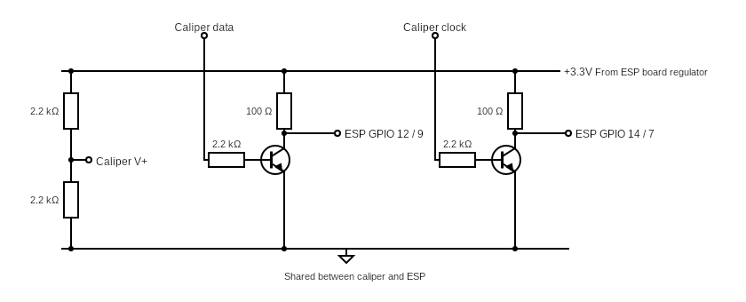

# Digital caliper component for ESPHome

The motivation to build this component was to have continuous measurements of distance with very high precision. It was greatly inspired by the schematics of the VINCA reader (https://github.com/liba2k/VINCA_reader), so I borrowed the schematics and added a voltage divider to power the caliper.

